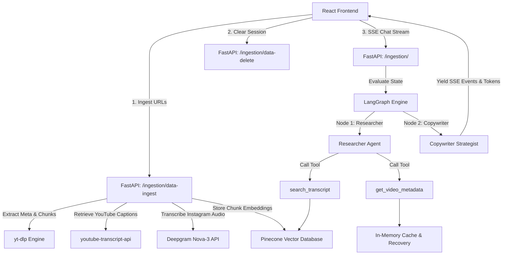

# videoMetric RAG Agent Dashboard

[](https://opensource.org/licenses/MIT)
[](https://fastapi.tiangolo.com)
[](https://react.dev)
[](https://vitejs.dev)
[](https://github.com/langchain-ai/langgraph)
[](https://www.pinecone.io)

An advanced, production-ready Dual-Video RAG (Retrieval-Augmented Generation) Chat Assistant and social creator intelligence dashboard. The application enables creators and content strategists to ingest video content from YouTube and Instagram, automatically extract transcripts and performance metrics, and perform deep strategic comparisons through a real-time, multi-agent conversational reasoning graph.

---

## Architecture Overview



The system operates as a unified RAG platform:
- **Client (Frontend)**: A premium HSL dark-themed UI resembling modern chat interfaces. Manages real-time Server-Sent Events (SSE) to update the conversational UI and visualize agent tasks in the sidebar timeline.
- **Server (Backend)**: Built with FastAPI, hosting custom data scraping services and a LangGraph workflow.
- **Data Layers**:
  - **Pinecone**: Serverless vector database holding segmented transcript chunks for semantic retrieval.
  - **In-Memory Cache**: Stores kalkulated engagement rates (view count, likes, comments, controversy scores, engagement rate per second) with self-healing loaders that automatically rebuild missing data upon server restarts.
- **Agent Intelligence**: Driven by a dual-agent graph (Researcher and Copywriter) executing specialized node behaviors and tool bindings.

---

## Features

* **Dual-Platform Ingestion**: Full support for ingesting YouTube videos (via auto-extracted captions and cookies) and Instagram Reels (via audio downloads and high-accuracy Deepgram Nova-3 speech-to-text API).
* **Self-Healing Metrics Cache**: Re-fetches and calculates engagement rates, like/comment ratios, and controversy scores on-the-fly, ensuring server restarts do not result in broken queries.
* **LangGraph Multi-Agent Reasoning Loop**: Runs a stateful agent flow where a Researcher agent collects facts using tools (`get_video_metadata` and `search_transcript`) and passes them to a Copywriter strategist agent for final report structuring.
* **Real-Time System Flow Panel**: Displays a chronological timeline of agent transitions and tool execution states (with arguments and results) using pulse-animated visual indicators and success checks.
* **Premium UX/UI**: Styled with responsive Glassmorphism design elements, auto-scrolling threads, collapsible JSON metadata inspectors, and Enter-key text submission key handlers.

---

## Tech Stack

* **Frontend**: React 18, Vite, HSL Vanilla CSS, JavaScript.
* **Backend**: FastAPI, Python 3.11, Uvicorn.
* **Orchestration**: LangGraph, LangChain.
* **Vector Database**: Pinecone Database.
* **Speech & Media**: `yt-dlp`, Deepgram SDK, `youtube-transcript-api`.
* **API Providers**: Groq Cloud (or Google AI Studio Gemini).

---

## Project Structure

```
videoMetric/
├── backend/                        # FastAPI Backend Application
│   ├── app/
│   │   ├── api/
│   │   │   └── route.py            # API Route Registrations
│   │   ├── core/
│   │   │   ├── chat.py             # Memory Caching & State Rebuilders
│   │   │   ├── data_extraction.py  # Cookie files and transcribing dispatchers
│   │   │   ├── graph.py            # LangGraph structure and SSE event streaming
│   │   │   └── pinecone_client.py  # Pinecone Client initialization
│   │   ├── model/
│   │   │   ├── chat_model.py       # LangGraph TypedDict states
│   │   │   ├── metadata_model.py   # Request validator structures
│   │   │   └── schemas.py          # API Pydantic JSON schemas
│   │   ├── rag/
│   │   │   ├── delete.py           # Namespace deletion utilities
│   │   │   ├── ingestion.py        # Text splitters & calculator functions
│   │   │   └── retreival.py        # Semantic vector search queries
│   │   ├── services/
│   │   │   ├── cookies.py          # Base64 cookie initialization
│   │   │   ├── metadata.py         # Media extraction using yt-dlp
│   │   │   └── transcript.py       # Transcript retrieval & transcribers
│   │   └── main.py                 # Core application boot & middleware setup
│   └── requirements.txt            # Python dependencies (pruned & validated)
├── frontend/                       # React Web Application
│   ├── src/
│   │   ├── api.js                  # SSE Stream parsers and request helpers
│   │   ├── App.jsx                 # Dynamic Dashboard and Chat View
│   │   ├── main.jsx                # DOM mounting
│   │   └── styles.css              # Glassmorphic Dark styling stylesheet
│   ├── package.json                # NPM configuration
│   └── vite.config.js              # Local proxies and bundler setup
└── README.md                       # Documentation File
```

---

## Prerequisites

To run this project, make sure you have installed:
- **Node.js** (v18.0.0 or higher)
- **Python** (v3.11 or higher)
- **Pinecone** Serverless API credentials and Index Host URL.
- **Groq Cloud** API Key (or Google AI Studio API Key).
- **Deepgram** API Key (required for Instagram Reels transcription).

---

## Environment Variables

### Backend `.env` configuration (place in `backend/.env`):

| Variable | Description | Required | Default |
| -------- | ----------- | -------- | ------- |
| `FRONTEND_ORIGIN` | Allowed CORS frontend origins. | Yes | `http://localhost:5173` |
| `GROQ_API_KEY` | API Key for Groq Cloud. | Yes | - |
| `GROQ_MODEL` | Groq Model name for nodes. | Yes | `llama3-8b-8192` |
| `PINECONE_API_KEY` | API key for Pinecone index. | Yes | - |
| `PINECONE_INDEX` | Host URL for Pinecone Serverless Index. | Yes | - |
| `NAMESPACE` | Vector database isolating namespace. | Yes | `videometric` |
| `DEEPGRAM_API_KEY` | Audio transcribing API key. | Yes | - |
| `TRANSCRIPT_SEGMENT_COUNT` | Number of segments to slice transcripts into. | No | `10` |

### Frontend `.env` configuration (place in `frontend/.env`):

| Variable | Description | Required | Default |
| -------- | ----------- | -------- | ------- |
| `VITE_API_URL` | Base URL pointing to the backend API. | Yes | `http://localhost:8000` |

---

## Installation

### 1. Backend Service Setup
```bash
# Navigate to the backend directory
cd backend

# Create a virtual environment
python -m venv venv

# Activate the virtual environment (Windows Command Prompt)
venv\Scripts\activate
# Or on macOS/Linux:
# source venv/bin/activate

# Install pruned requirements
pip install -r requirements.txt

# Create your .env file
copy .env.example .env # On Windows Command Prompt
# cp .env.example .env # On macOS/Linux

# Configure keys inside backend/.env
```

### 2. Frontend Client Setup
```bash
# Navigate to the frontend directory
cd ../frontend

# Install node dependencies
npm install

# Create your .env file
copy .env.example .env # On Windows Command Prompt
# cp .env.example .env # On macOS/Linux

# Configure frontend/.env with VITE_API_URL
```

---

## Running the Project

### Development Execution

1. **Start Backend Server**:
   ```bash
   cd backend
   venv\Scripts\activate
   uvicorn app.main:app --reload --host 0.0.0.0 --port 8000
   ```
2. **Start Frontend Client**:
   ```bash
   cd frontend
   npm run dev
   ```
   Open `http://localhost:5173` in your web browser.

### Production Execution

1. **Build Frontend**:
   ```bash
   cd frontend
   npm run build
   ```
2. **Launch Production Backend**:
   ```bash
   cd backend
   uvicorn app.main:app --host 0.0.0.0 --port 8000
   ```

---

## API Documentation

### 1. Health Status
- **URL**: `/health`
- **Method**: `GET`
- **Response**:
  ```json
  {
    "status": "ok"
  }
  ```

### 2. Video Data Ingestion
- **URL**: `/ingestion/data-ingest`
- **Method**: `POST`
- **Request Body**:
  ```json
  {
    "url": "https://www.youtube.com/watch?v=dQw4w9WgXcQ",
    "language": "en"
  }
  ```
- **Response**:
  ```json
  {
    "status": "ok",
    "source": "youtube",
    "video_id": "dQw4w9WgXcQ",
    "title": "Rick Astley - Never Gonna Give You Up",
    "chunks_stored": 5,
    "metadata_stored": true
  }
  ```

### 3. SSE Chat Workspace
- **URL**: `/ingestion`
- **Method**: `POST`
- **Request Body**:
  ```json
  {
    "query": "Compare the view counts of the ingested videos.",
    "userContent": [
      { "url": "...", "video_id": "vid_1", "result": { ... } },
      { "url": "...", "video_id": "vid_2", "result": { ... } }
    ],
    "user_id": "user-uuid-string",
    "chat_id": "chat-uuid-string"
  }
  ```
- **Response Stream (SSE/text-event-stream)**:
  - *Node Activation Event*:
    ```
    data: {"type": "node_start", "node": "researcher"}
    ```
  - *Tool Invocation Event*:
    ```
    data: {"type": "tool_start", "tool": "get_video_metadata", "input": {"video_id": "vid_1"}}
    ```
  - *Tool Completion Event*:
    ```
    data: {"type": "tool_end", "tool": "get_video_metadata", "output": "..."}
    ```
  - *Token Stream Event*:
    ```
    data: {"type": "token", "content": "Hello"}
    ```

### 4. Clear Vector Database & Session State
- **URL**: `/ingestion/data-delete`
- **Method**: `DELETE`
- **Response**:
  ```json
  {
    "status": "ok",
    "namespace": "videometric"
  }
  ```

---

## Screenshots

Below is the layout preview of the videoMetric interface:

```
+---------------------------------------------------------+
| videoMetric             | Dual Video RAG Chat Assistant |
+-------------------------+-------------------------------+
| VIDEO INGEST            |                               |
| URL 1: [             ]  |  [User] Compare likes.        |
| URL 2: [             ]  |                               |
| [Ingest & Start]        |  [Assistant]                  |
|                         |  🎯 Vibe Check: ...           |
| AGENT WORKFLOW          |  📊 Evidence: ...             |
| * Researcher Agent      |  🚀 Playbook: ...             |
|   (fetching tools...)   |                               |
| * Tool: get_meta (Done) |                               |
| * Copywriter (Active)   |                               |
|                         |                               |
| SESSION SOURCES         |                               |
| 1. Video Title 1        |                               |
| 2. Video Title 2        | [ Submit query           ] >  |
+-------------------------+-------------------------------+
```

---

## Contributing

1. Fork the Project.
2. Create a Feature Branch (`git checkout -b feature/NewFeature`).
3. Commit your Changes (`git commit -m 'Add NewFeature'`).
4. Push to the Branch (`git push origin feature/NewFeature`).
5. Open a Pull Request.

---

## License

Distributed under the MIT License. See [LICENSE](LICENSE) for details.
